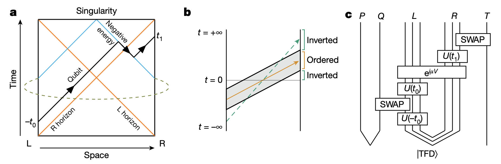

# QuantumWormhole: QHack 2023 Open Hackathon

## Project
Implementing traversable wormhole dynamics on a quantum processor

## Team
Yellow Submarine: [Dohun Kim](https://github.com/yh08037), [Yuri Han](https://github.com/urihan)

## Goal
Our team is aiming to implement and reproduce the results of the paper ["Traversable wormhole dynamics on a quantum processor"](https://www.nature.com/articles/s41586-022-05424-3), Nov 2022. 

## Submission 
Please check jupyter notebook named `submission.ipynb`.
